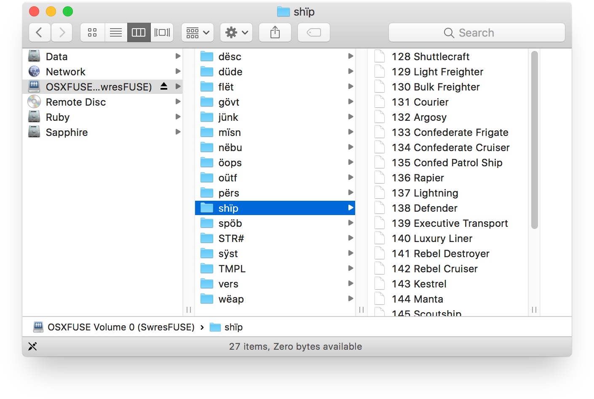

SwresTools is a set of two tools for exploring and dumping classic Macintosh resource forks, written in Swift.

SwresTools can convert some resources to modern types. For example, it can translate some <code>snd </code> resources to WAV files.

To be honest, this was just a fun side project and shouldn't be used for anything important.

### SwresExplode

`SwresExplode` dumps the resources of a classic Macintosh resource fork to individual files.

For example, list all of the resource types in a resource fork:

	SwresExplode resourcefile
	
Dump all `snd ` resources to individual files:

	SwresExplode -d -t 'snd '

### SwresFUSE

`SwresFUSE` mounts a resource fork as a filesystem. It requires [FUSE for macOS][fuse].

Example usage:

	SwresFUSE resourcefile mountpoint
	

[fuse]: https://osxfuse.github.io

### Why?

¯\\_(ツ)\_/¯

### No, Really, Why?

I wanted to rip the music out of the old Mac game [Troubled Souls][troubledsouls], and this seemed like such a bad way to go about it I had to give it a go. I was playing around with Swift and thought this would be a fun way to write a project that interfaced with a C library.

[troubledsouls]: https://en.wikipedia.org/wiki/Troubled_Souls

### Building

You may need to point the header parameter of Modules/FUSE/module.modulemap to your FUSE header directory. For some reason module maps don't seem to respect header search paths and need absolute paths.

### Limitations

* The translators are very limited. Only Pascal style prefix strings and an extremely limited subset of `SND` resources are supported.
* ResEdit features like `RMAP` and `TMPL` resources are not supported.
* Editing or creating new resources is not supported.